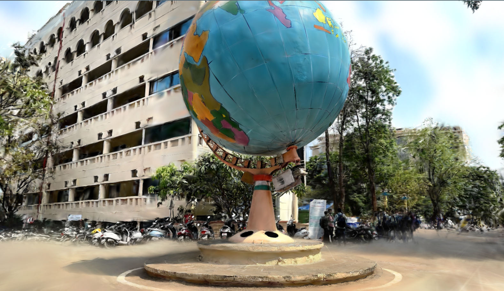

# Luma Splatting for Babylon.js


https://github.com/drumath2237/luma-splatting-for-babylonjs/assets/11372210/271bfb8f-4a4f-4ce3-9660-676c1f7579e6

## About

A library to load LumaAI Gaussian Splatting into Babylon.js, like the [Luma Web Library](https://lumalabs.ai/luma-web-library).



## Environment

- Babylon.js 7.23.0
- Node.js 18,20

## Install & Usage

For npm

```bash
# install deps for npm
npm install -D @babylonjs/core luma-splatting-for-babylonjs

# or for yarn
yarn add -D @babylonjs/core luma-splatting-for-babylonjs

# or for pnpm
pnpm add -D @babylonjs/core luma-splatting-for-babylonjs
```

You can load and put the gaussian splatting data with code like below.

```ts
import { Engine, Scene } from "@babylonjs/core";
import { LumaGaussianSplatting } from "luma-splatting-for-babylonjs";

// ...

const engine = new Engine(renderCanvas);
const scene = new Scene(engine);
scene.createDefaultCameraOrLight(true, true, true);

// 1. Create LumaGaussianSplatting Object.
// 2. Load splat data with UUID
//    and put the gaussian splatting into your scene.
const uuid = "ca9ea966-ca24-4ec1-ab0f-af665cb546ff";
const lumaSplat = new LumaGaussianSplatting("luma splat", scene);
await lumaSplat.loadDataWithUuidAsync(uuid);

window.addEventListener("resize", () => engine.resize());
engine.runRenderLoop(() => scene.render());
```

## Author

[@drumath2237](https://twitter.com/ninisan_drumath)
